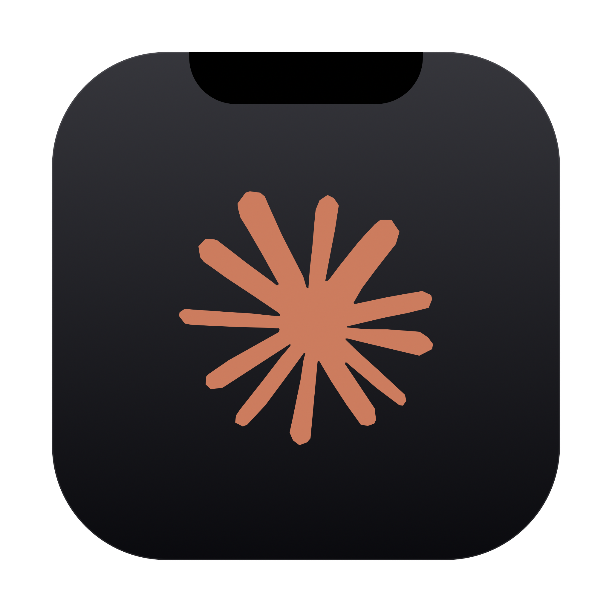
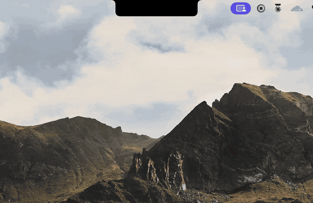
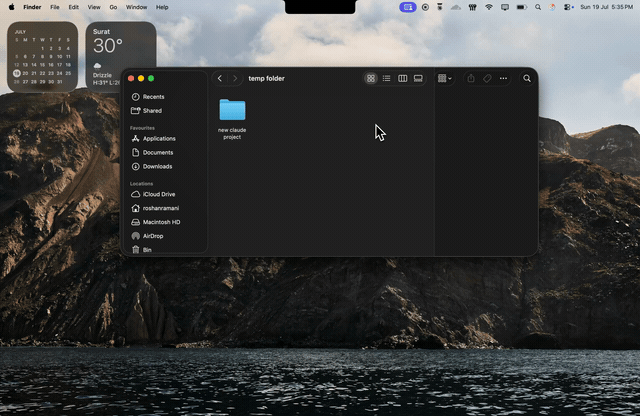
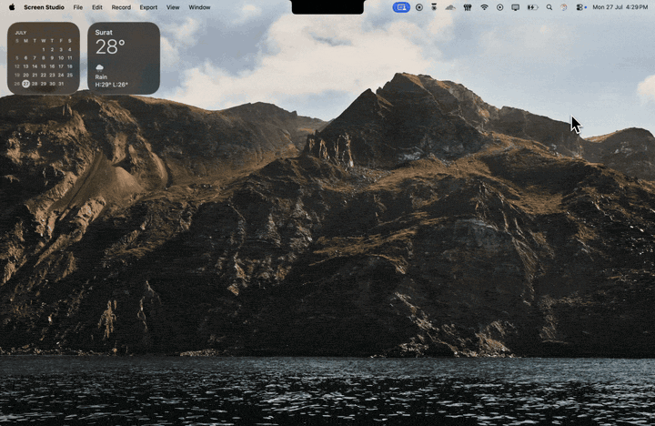

<div align="center">



# ClaudeNotch

### Approve Claude Code without leaving your work.

ClaudeNotch puts every Claude Code permission prompt, question, and notification
right in your Mac's notch. Read the diff, allow or deny with one key, and stay in
your editor, no more tabbing back to the terminal every few seconds.

<br/>

[](https://github.com/rawsun007/claude-notch/releases/latest/download/ClaudeNotch.dmg)
&nbsp;
[](https://rawsun007.github.io/claude-notch/)

[](https://github.com/rawsun007/claude-notch/actions/workflows/ci.yml)


<br/>



</div>

---

## What is ClaudeNotch?

When you use [Claude Code](https://claude.com/claude-code), it constantly stops to
ask permission, *"Can I run this command?"*, *"Can I edit this file?"* Every prompt
pulls you back to the terminal and breaks your flow.

**ClaudeNotch is a tiny macOS menu-bar app that surfaces those prompts in a
Dynamic-Island-style overlay at the top of your screen.** The notch quietly
expands with the command (or a diff of the change), you click **Allow** or
**Deny**, or just tap a key, and your keyboard pops right back to where you
were. You never switch apps.

It runs entirely on your machine, talks to Claude Code through its official hook
system, and shows no Dock icon, just a small bell in your menu bar.

---

## 🎬 In motion

**Start a session from the notch**: drag a project folder onto the notch and a Claude Code session opens in that directory. No terminal, no `cd`.



**A pet that reacts to your session**: the mascot lives in the notch and animates around what Claude is doing.


**Little moments of delight**: playful touches that make the notch feel alive while you work.


**In your language**: pick one of ten languages in Settings and the notch and the settings window switch straight away, no restart.



---

## ✨ Features

| | |
|---|---|
| 🛡️ **Permissions in the notch** | When Claude wants to run a command or edit a file, the notch unfurls with **Allow**, **Deny**, and **Always Allow**. Resolve it and your keyboard jumps straight back to the terminal. |
| 🟥🟩 **See the diff first** | Edit and Write requests show a red/green diff right inside the card, so you know exactly what's about to change. |
| ⚠️ **Guardrails for risky commands** | Dangerous ones like `rm -rf`, `sudo`, and force-push get a red warning. Confirm them with **Touch ID** (or Face ID), or a **press-and-hold** button when Touch ID is off, so nothing irreversible slips through by accident. |
| 💬 **Deny with a reason** | Not just no. Tap the note button on a prompt to tell Claude what to do instead (say "use ripgrep, not grep"), and it adapts rather than just stopping. |
| ❓ **Answer Claude's questions** | `AskUserQuestion` prompts arrive as tappable options, with a **type-your-own** field for when none of them fit. |
| ↩️ **Reply when a task finishes** | The "done" card has a **Reply** button that opens a composer pointed right at that session, so you can send a follow-up without switching windows. |
| ⚡ **Live activity + progress** | While Claude works, the notch shows what it's doing right now (the active tool and its target) and a **progress bar** as it works through a task list. |
| 📊 **Context + cost meter** | Each session shows how full Claude's context window is and a running cost estimate, so you get a heads-up before it pauses to compact. |
| 💸 **Spending caps + alerts** | Set a budget per session and per day. As you near a cap the session's cost figure warms orange then red, and a card warns you at 80% and again at 100%, so a long run never quietly runs up a bill. (Costs are estimates from public pricing, so treat the caps as a guardrail.) |
| 📈 **Claude usage, broken down** | A **Claude Usage** menu shows your tokens and estimated cost for today and the last 7 days, by model and by project (priciest repos first), plus a 7-day token sparkline and your prompt-cache savings. |
| 🪟 **Many sessions at once** | Run several Claude sessions side by side. The notch tracks each one separately, with its own status, project, and latest reply. |
| ✉️ **Send a message from anywhere** | Press **⌥⌘N** to open a quick composer. Send a note to your running session, or start a fresh one in a recent project. |
| 🕘 **Activity history** | Click the notch for a timeline of everything you've allowed, denied, or answered. |
| ✅ **Smart always-allow** | Approve a tool for the whole session, or just one exact command. Your rules stick around between launches, and **Settings → Rules** shows the whole list so you can read what you have agreed to, delete a rule, add one by hand, or hand the lot to Claude Code's own `settings.json`. |
| 📁 **Start Claude in any folder** | Launch Claude Code in any project straight from the menu bar, or jump back into a recent one. |
| 🐾 **Pet Mode** | The Claude mascot lives in your notch. While nothing is happening it peeks out, looks around, hangs off the corner, strolls along the edge, and naps after a quiet spell, then hops with sparkles when a task finishes. It watches your cursor and leans toward it, holds still to be petted, and boops when you click it. Boop it five times fast. It never appears over an active session or a card you're reading, it respects **Reduce Motion**, and the **Pet Mode** menu item turns it off. |
| 🏷️ **Personalise the notch title** | Pick what the notch calls itself from the **Notch Title** menu, keep **Claude**, track the active **project name**, or type your own **custom** label. It updates live and sticks between launches. |
| 🗣️ **Works with VoiceOver** | The notch never steals focus, so a card could sit there silently. When one appears it is announced instead: the ask, the diff read as "removing 1 line, adding 2", and the keys that answer it. A queue says Return would allow all of them, and a destructive command never claims a key that does nothing. Resolving speaks the outcome, so you know Allow from Deny without looking. |
| 🖥️🖥️ **Every screen at once** | Working on an external monitor? The notch (or a floating pill on a display with no physical notch) renders on every screen at the same time, and hover-expand follows your cursor between them, so the card is wherever you are actually looking. |
| 🌍 **Nine languages** | Simplified Chinese, Spanish, Hindi, Portuguese, Japanese, German, French, Korean, and Russian. Pick one from **Settings → General → Language** and it applies immediately, no restart. |
| 🔮 **See the bill coming** | **Settings → Budget** projects what today finishes at from the rate so far, the clock time it would cross your daily cap, and what the month comes to. A card gives you one heads-up while the cap is still ahead of you, rather than only telling you once the money is gone. |
| ⏳ **See your usage limit coming** | Hover a plan-limit bar and, once there is enough data to trust, it projects when the cap arrives at the rate you are actually spending, not just where you are right now. Says nothing when the window resets first or the answer is hours away. |
| 🔍 **Check what Claude actually did** *(opt-in)* | Off by default, in **Settings → Session**. When on, a finished task is checked against what really happened: if the closing message claims a change the turn never made, or says the tests pass when none ran, the card says so. Silent the rest of the time, since a verdict that fires on every ordinary turn is one you stop reading. |

---

> **Coming from Vibe Notch / Claude Island?** See [MIGRATING.md](MIGRATING.md).
> One command moves you over, and it lists honestly what is already fixed here
> and what still is not.

## 🚀 Install

**Needs:** macOS 13 Ventura or later, on Apple Silicon or Intel. The disk image
is universal from v0.14.0 onward; earlier releases are Apple Silicon only.

### The easy way (recommended)

1. **[⬇ Download ClaudeNotch.dmg](https://github.com/rawsun007/claude-notch/releases/latest/download/ClaudeNotch.dmg)**
2. Open the DMG and drag **ClaudeNotch** into **Applications**.
3. Double-click ClaudeNotch. It opens straight away, no Gatekeeper warning and
   no right-click trick: the app and the disk image are signed with a Developer
   ID and notarized by Apple, and the notarization ticket is stapled, so the
   check passes even with no network.
4. A small **bell icon** appears in your menu bar. Click it → **Setup** to
   wire up the Claude Code hooks. Done!

> 🔐 **Check it yourself before you trust it.** On any copy you download:
>
> ```bash
> spctl -a -vvv /Applications/ClaudeNotch.app
> ```
>
> Expect `source=Notarized Developer ID` and
> `origin=Developer ID Application: Alfastack Solution Private Limited (PS8FJ3MQB2)`.
> Anything else is not a build we published, whatever it calls itself. Nothing
> we ship ever asks you to bypass Gatekeeper.

> **Tip:** To launch automatically on startup, click the menu-bar bell →
> *Launch at Login*.

### With Homebrew

One line:

```bash
brew install --cask rawsun007/tap/claudenotch
```

### Build from source (for developers)

<details>
<summary>Click to expand</summary>

Requires macOS 13+, Swift 5.9+ (`xcode-select --install`), and `jq` (`brew install jq`).

```bash
git clone https://github.com/rawsun007/claude-notch.git
cd claude-notch
./build.sh        # produces ClaudeNotch.app (universal: arm64 + x86_64)
./install.sh      # copies to /Applications, wires Claude Code hooks, launches
```

`build.sh` compiles both architectures and `lipo`s them together, then fails if
either slice is missing, so a single-arch build can never reach a release.
Command Line Tools are enough: `swift build --arch arm64 --arch x86_64` needs
full Xcode, so the second slice is cross-compiled into its own scratch path
instead. That costs about a minute per build, so while iterating:

```bash
CLAUDENOTCH_SKIP_UNIVERSAL=1 ./build.sh   # native slice only, never release this
```

Want your macOS permission grants (Accessibility) to survive every rebuild? Run
this once before building, it creates a stable self-signed identity so the app's
signature stops changing:

```bash
./tools/make-signing-cert.sh
```

</details>

---

## 🎮 Try it in 30 seconds

After installing, you don't even need Claude Code to see it work:

> Click the menu-bar **bell → Demo: tool permission**. The notch should expand
> with a sample command and Allow / Deny buttons.

Then, with a real session:

1. Open Claude Code in any project.
2. Ask it to run a command, write a file, or edit something.
3. The notch expands at the top of your screen with the details and buttons.
   **Whatever you click is what Claude does next**, no need to switch back.

ClaudeNotch surfaces the prompts that matter: command runs, file writes and
edits, plan approvals, to-do updates, and `AskUserQuestion`. Quiet tools like
searching files use Claude Code's normal flow, so you're not pestered for every
little thing. And if ClaudeNotch isn't running, Claude Code just shows its own
prompt as usual, so nothing breaks.

---

## ⌨️ Keyboard shortcuts

| Key | Action |
|-----|--------|
| **Enter** | Allow the current permission (or confirm the focused card) |
| **Esc** | Deny / dismiss the current card |
| **⌥⌘N** | Open the quick message composer from anywhere |
| **⌘↩** | Send the message in the composer (plain Enter inserts a newline) |

> Keyboard control needs macOS **Accessibility** permission (System Settings →
> Privacy & Security → Accessibility). The app will prompt you the first time.

---

## 🔗 Drive it from anything: `claudenotch://`

Anything that can open a URL can drive the notch: a Shortcut, a Raycast or
Alfred script, a Stream Deck button, a link in your notes, or plain
`open` in a terminal.

| URL | What it does |
|-----|--------------|
| `claudenotch://open` | Reveal the notch card, as hovering it would |
| `claudenotch://resume` | Resume the most recent session |
| `claudenotch://resume/myapp` | Resume the most recent session in that project |
| `claudenotch://compose` | Open the quick message composer |
| `claudenotch://compose/myapp` | Compose aimed at that project |
| `claudenotch://standup` | Copy today's standup to the clipboard |
| `claudenotch://history` | Open the history drawer |
| `claudenotch://settings` | Open the settings window |

A project is a **name**, never a path. A link can only reopen a directory you
have genuinely worked in, so a web page cannot point the agent somewhere of its
own choosing.

### AppleScript and Shortcuts

The same verbs are scriptable, which also works from Shortcuts' **Run
AppleScript** action, Stream Deck, Keyboard Maestro, and your own scripts.
Open ClaudeNotch in Script Editor's dictionary browser to see it all.

```applescript
tell application "ClaudeNotch"
    resume session "myapp"     -- true if a session was found
    compose message "myapp"
    copy standup               -- also returns the text
    show notch                 -- or: show history / show settings
end tell
```

Scripting can also read back what the notch knows, which a URL cannot:

```applescript
tell application "ClaudeNotch"
    get today spend        --> 4.12      (US dollars, estimated)
    get session count      --> 3
    get working count      --> 1         (running a tool right now)
    get pending count      --> 1         (cards waiting on you)
    get current project    --> "myapp"
    get current activity   --> "Bash: npm test"
end tell
```

---

## 🔒 Privacy

Everything stays on your machine. ClaudeNotch talks to Claude Code over a
**localhost-only** connection (`127.0.0.1`) and never sends your prompts,
commands, or code anywhere. No accounts, no telemetry, no servers.

This app decides which commands an AI agent may run on your Mac, so it is a
security tool whether or not it is described as one.
[SECURITY.md](SECURITY.md) says what it defends against, what it does not, and
how to report a vulnerability privately. Please do not open a public issue for
a security bug.

---

## 🧠 How it works

```
Claude Code  ──▶  PreToolUse hook  ──▶  POST /permission  ──▶  ClaudeNotch
                                                                    │
                                                          notch shows the card
                                                                    │
                                                            you click Allow
                                                                    │
                                          {"decision":"allow"}  ◀───┘
                                                    │
                                                    ▼
                                          Claude Code runs the tool
```

The hook holds the connection open while it waits for your click. If anything
goes wrong, app not running, timeout, missing dependency, it safely falls back
to Claude Code's own prompt, so there's no way to get stuck.

---

## ❓ FAQ

**Is it free?**
Yes, free for personal and any noncommercial use, and the full source lives right
here on GitHub. **Commercial use isn't allowed without permission**, if you want to
sell it or make money from it, [ask me first](https://www.linkedin.com/in/roshan-ramani-0510102b2).

**Does macOS warn me on first open?**
No. The app and the DMG are signed with a Developer ID (team `PS8FJ3MQB2`) and
notarized by Apple, with the ticket stapled, so a fresh download launches with no
warning. If a copy of "ClaudeNotch" does make macOS complain, it did not come
from us, don't click through it. Verify with
`spctl -a -vvv /Applications/ClaudeNotch.app`.

**Do my Accessibility and Input Monitoring grants survive an update?**
Yes, from the first notarized release on. Those permissions are remembered
against the code signature, and every build now carries the same Developer ID
identity instead of a per-build ad-hoc one, so you grant them once rather than
after each update.

**Does it send my data anywhere?**
No. Everything runs locally over a localhost hook. Nothing leaves your machine.

**Which AI tools does it support?**
Claude Code and the Codex CLI. Setup wires hooks into `~/.claude` and `~/.codex`,
and sessions from both show up side by side in the notch, each tagged with the
agent it came from.

**I run Claude Code inside VS Code or the Claude Desktop app and the notch stays quiet.**
Update the Claude Code CLI to **2.1.233 or later**. Before that version it did not
fire notification hooks for permission prompts when running under those hosts, so
the notch never heard that a prompt was waiting on you. Check with `claude --version`.

**Which Macs does it run on?**
macOS 13 Ventura and later, Apple Silicon or Intel. See the note under
[Install](#-install) about Intel and the current release.

**Can I uninstall the hooks?**
Yes, your `settings.json` is backed up during setup, and there's an uninstall
script (below) to remove everything cleanly.

---

## ⬆️ Update

Installed with Homebrew:

```bash
brew upgrade --cask rawsun007/tap/claudenotch
```

Installed from the DMG, which Homebrew cannot update:

```bash
~/.claudenotch/bin/claudenotch-update.sh
```

It checks what is published, verifies the download against the checksum in the
Homebrew tap, quits the running copy, replaces it, and relaunches. Pass
`--check` to see what is available without changing anything. If it finds the
app was installed by Homebrew after all, it says so and stops rather than
replacing it behind Homebrew's back.

The settings window also shows the version you are on beside the page title,
and turns it into a button when a newer release is out.

---

## 🧹 Uninstall

```bash
~/.claudenotch/bin/uninstall-hooks.sh        # unwire from Claude Code
rm -rf /Applications/ClaudeNotch.app ~/.claudenotch
```

---

## 🛠️ For the curious: project layout

<details>
<summary>Click to expand</summary>

The spine: Claude Code and Codex fire hooks over HTTP, `EventServer` parses and
normalizes them, `AppState` holds the result, `NotchView` draws it. Blocking
hooks (permission, question) hold the connection open until you answer, and your
decision becomes the response.

```
Sources/ClaudeNotch/
  main.swift / AppDelegate.swift   : boots as a menu-bar accessory app (no Dock)
  EventServer.swift                : localhost HTTP server + blocking permission
  AppState.swift                   : the single source of truth (@MainActor)
  AppState+*.swift                 : one file per concern, Pet / Usage / Budget /
                                     Git / TaskMeter / Sessions / Compose /
                                     History / Export / Queues / Alerts / Sound
  SessionModels / UsageModels /
  RequestModels.swift              : the value types the rest is built on
  Persistence.swift                : always-allow rules, history and stats on disk

  NotchView.swift                  : the notch's root view + card sizing
  NotchShape.swift                 : the concave "Dynamic Island" shape
  NotchWindowController.swift      : borderless panel that follows your screen
  NotchPermissionCard.swift        : banners, diff preview, hold-to-confirm
  NotchSessionList / NotchStatusBar / NotchIdlePill / NotchCards /
  NotchComposeCards / NotchHistoryCard / NotchPetViews / NotchMarkdown
  SettingsWindow.swift             : settings, search, History page, standup
  MenuBarController.swift          : the menu-bar bell and its menu
  Onboarding*.swift                : first-run setup and hook install

  AgentAdapter.swift               : Claude / Codex / Grok differences in one place
  ClaudeUsageReader / CodexReader  : cost, context and plan state from transcripts
  SessionResumer / BackgroundAgents: resumable sessions, the `claude --bg` roster
  TerminalAutomator.swift          : launches or resumes an agent in a terminal
  HookInstaller.swift              : wires/unwires hooks in ~/.claude and ~/.codex
  ToolPreviewParser.swift          : diff/danger preview for a tool call
  BiometricAuth.swift              : Touch ID confirm for dangerous commands
  KeyboardMonitor / MouseTracker /
  GlobalHotkey / FocusTracker      : keys, hover, ⌥⌘N composer, break timer
  PetEngine.swift / PetRig.swift   : the pet, logic split from rendering
  Shell / Git / FileSlice /
  DebugLog / CrashReporter         : the shared helpers everything reuses
  UpdateChecker.swift              : checks GitHub for new releases

bin/                          : the Claude Code + Codex hook scripts
build.sh                      : builds ClaudeNotch.app (universal binary)
install.sh                    : installs to /Applications + wires hooks
tools/                        : DMG builder, icon generators, signing cert,
                                releaser, download-stats.sh
Tests/                        : XCTest suite, run by CI on every push
```

**Localhost endpoints** (for tinkering):

| Endpoint | What it does |
|----------|--------------|
| `POST /hook` | One endpoint for every event, dispatched on the payload's own type |
| `POST /permission` | Blocks until you click; returns `{"decision":"allow\|deny\|ask","reason":"…"}` |
| `POST /question` | Blocks until you answer; returns your picks (or a typed answer) |
| `POST /extpretool` | Codex tool call: brief card if safe, blocking allow/deny if dangerous |
| `POST /notification` | Sticky orange "needs your input" card |
| `POST /stop` | Sticky green "task done" card |
| `POST /activity` | Updates the live "what Claude's doing" strip |
| `POST /prompt` | Records your prompt and marks the session thinking |
| `POST /task` | Task created/completed, for the per-session progress meter |
| `POST /sessionend` | Drops a finished session from the notch |
| `POST /pretool` | Brief blue thinking pulse |
| `POST /compact` | Context was compacted, resets the context meter |
| `POST /statusline` | Feeds the status line's model, cost and context numbers |
| `POST /subagentstart` | A subagent spun up under the session |
| `POST /thinking` | Back to thinking after a tool finished |
| `POST /ping` | Liveness check |

</details>

---

## 👋 Made by Roshan Ramani

If ClaudeNotch saves you a few context switches, a ⭐ on the repo means a lot.

[](https://www.linkedin.com/in/roshan-ramani-0510102b2)
&nbsp;
[](https://x.com/roshanramani007)

Found a bug or have an idea? [Open an issue](https://github.com/rawsun007/claude-notch/issues), feedback welcome.

---

## 📄 License

**PolyForm Noncommercial License 1.0.0** © 2026 Roshan Ramani.

Free to use, modify, and share for **personal, educational, and other noncommercial
purposes**. **Commercial use is not permitted without a separate license**, if you'd
like to use ClaudeNotch commercially or build a paid product on it, please
[reach out first](https://www.linkedin.com/in/roshan-ramani-0510102b2). See
[LICENSE](LICENSE) for full terms.

<div align="center">
<sub><b>ClaudeNotch</b>, a Dynamic Island / notch overlay for Claude Code on macOS · permission prompts, diffs &amp; notifications in your menu bar · Swift · noncommercial &amp; source-available</sub>
</div>
